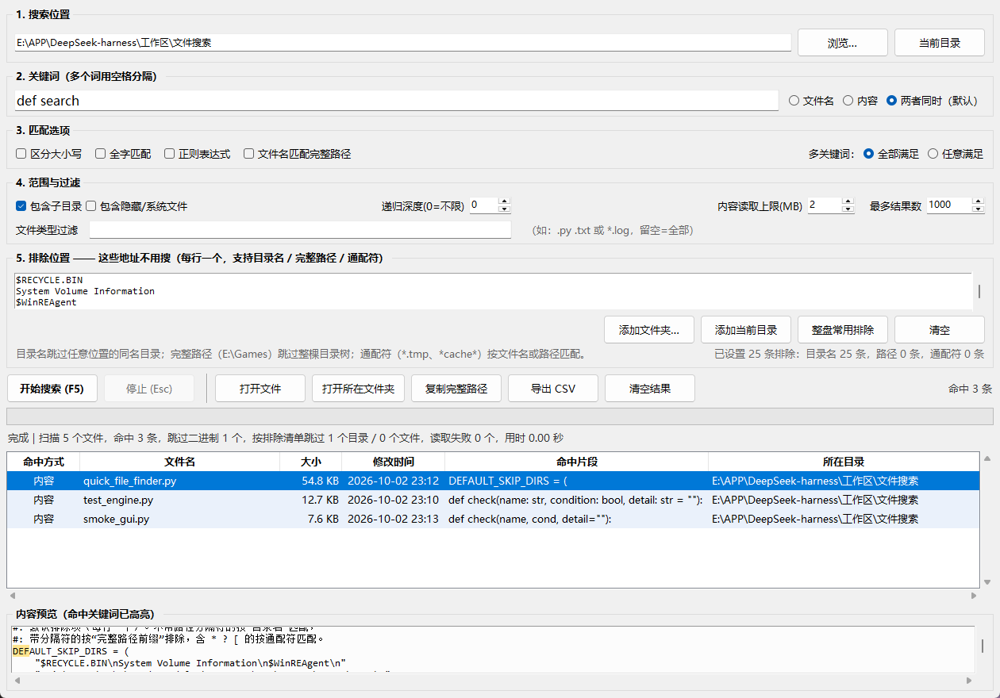

# Quick File Finder · 快速文件搜索器

> 由人工智能创作
> 我几乎把我的内裤翻给你看了
> 漏洞or功能：3814859587@qq.com

一个带图形界面的本地文件搜索工具：既能按**文件名**查找，也能按**文件内容**查找，只依赖 Python 标准库（tkinter），零第三方依赖。

一個帶圖形介面的本機檔案搜尋工具：既能按**檔名**查找，也能按**檔案內容**查找，只依賴 Python 標準函式庫（tkinter），零第三方依賴。

A GUI tool for local file search by **filename** and/or **file content**. Standard-library only (tkinter), zero third-party dependencies.

Инструмент с графическим интерфейсом для поиска локальных файлов по **имени** и/или **содержимому**. Только стандартная библиотека (tkinter), без сторонних зависимостей.



---

## 语言 / 語言 / Language / Язык

- [简体中文](#简体中文)
- [繁體中文](#繁體中文)
- [English](#english)
- [Русский](#русский)

---

# 简体中文

## 这是什么

**快速文件搜索器** 是一个桌面 GUI 工具，用两种方式搜索本地文件：

1. **按文件名** —— 你只记得名字的一部分。
2. **按文件内容** —— 你记得文件里的一句话。

默认**两种方式同时进行**：文件名**或**内容里包含关键词就算命中（OR 语义），结果实时列在窗口里。

只依赖 Python 内置的 `tkinter`，**无需安装任何第三方包**。

## 功能

- **两种搜索模式**（可切换）：文件名 / 内容 / 两者同时（默认）。
- **多关键词**（空格分隔），支持 **AND**（全部满足）或 **OR**（任意满足）。
- **匹配选项**：区分大小写、全字匹配、正则表达式（`^` `$` 按行匹配）、文件名匹配完整路径。
- **文件类型过滤**：`.py .txt`，或通配符 `*.log`、`test_*.py`。
- **排除位置**（整盘搜索的关键）：按**目录名**、**完整路径**或**通配符**排除；被排除的目录**在进入之前就剪枝**，根本不会被打开。
- **范围控制**：是否递归、递归深度、包含隐藏/系统文件、内容读取上限（每文件 MB）、最多结果数。
- **内容搜索更聪明**：自动跳过二进制（图片、压缩包、exe、Office 文档…）、自动识别编码（UTF-8 / UTF-8-BOM / UTF-16 / UTF-32 / GB18030 / Big5 / CP1252）、每个文件最多只读前 N MB。
- **结果表格**：命中方式、文件名、大小、修改时间、命中片段、所在目录，点击表头排序。
- **实时预览**：关键词高亮，自动滚动到命中行。
- **结果操作**：双击打开文件；右键菜单打开所在文件夹（自动选中该文件）、复制路径、复制片段、导出 CSV。
- **CSV 导出**：UTF-8 带 BOM，Excel 双击即可正常显示中文。
- **界面不卡死**：搜索在后台线程运行，进度条/状态栏实时刷新，可随时停止。
- **记住设置**：关闭时把条件存到脚本旁的 `.quick_file_finder.json`，下次自动恢复。
- **窗口自适应屏幕**：小屏自动变矮，不会被任务栏挡住。

## 环境要求

- Python **3.8+**（在 3.12 上测试过），需包含 Tcl/Tk（Windows 官方安装包默认自带）。

## 安装与运行

无需安装，直接运行：

```bat
python quick_file_finder.py
```

## 使用方法

### 界面分区

| 区域 | 作用 |
| --- | --- |
| 1. 搜索位置 | 要搜索的文件夹（可浏览选择，或「当前目录」） |
| 2. 关键词 | 要找的名字/内容，多个词空格分隔；右侧选 文件名 / 内容 / 两者同时 |
| 3. 匹配选项 | 大小写、全字、正则、完整路径、多关键词 AND/OR |
| 4. 范围与过滤 | 递归、隐藏文件、深度、读取上限、结果数、文件类型过滤 |
| 5. 排除位置 | **「这些地址肯定没有」清单**：整盘搜索时直接跳过 |
| 结果表格 | 可排序，显示命中方式、文件名、大小、时间、片段、目录 |
| 内容预览 | 选中文件的内容，命中关键词高亮 |

### 排除位置：整盘搜索的关键

搜整个盘（如 `E:\`）时，有些地址**肯定不会有目标文件**，挨个翻就是白费时间。把它们每行一条写进「排除位置」，程序会在**进入目录之前剪枝**，被排除的目录根本不会被打开。

三种写法可混用（不区分大小写）：

| 写法 | 含义 | 例子 |
| --- | --- | --- |
| 目录名 | 跳过任意位置的同名目录 | `node_modules`、`Windows`、`$RECYCLE.BIN` |
| 完整路径 | 跳过该路径及其全部子项 | `E:\Games`、`E:\备份\旧项目`、`E:\huge.iso` |
| 通配符 | 按文件名或完整路径匹配 | `*.tmp`、`*cache*`、`E:\*\Temp` |

- 路径末尾带不带 `\` 都一样。
- 一行里可用空格写多个**名字**；含路径分隔符的行整行按路径处理（所以 `C:\Program Files` 不会被拆坏）。
- **「添加文件夹…」** 从磁盘挑目录；**「整盘常用排除」** 一键填入 `Windows`、`Program Files`、`Program Files (x86)`、`ProgramData`、`AppData`、`$RECYCLE.BIN`、`System Volume Information`、`Temp`、`Cache` 等。
- 误把**搜索目录本身**写进清单（会导致什么都搜不到）时会被自动忽略并在状态栏提示。
- 搜索结束状态栏会报告「按排除清单跳过 N 个目录 / M 个文件」。

### 命中方式

- `文件名` —— 文件名（或完整路径）含关键词。
- `内容` —— 文件内容含关键词（表格里给出命中的那一行）。
- `文件名+内容` —— 两者都命中，排在最前。

### 常见用法

| 想做的事 | 怎么填 |
| --- | --- |
| 找名字带 `report` 的文件 | 关键词 `report`，模式「文件名」 |
| 找哪个文件写过某句话 | 关键词填那句话，模式「内容」 |
| 不确定哪种 | 保持默认「两者同时」 |
| 只在 Python 文件里找 | 文件类型过滤 `.py` |
| 只找某类日志 | 文件类型过滤 `*.log` 或 `*.2024-*.log` |
| 找同时含 A 和 B 的文件 | 关键词 `A B`，选「全部满足」 |
| 找含 A 或 B 的文件 | 关键词 `A B`，选「任意满足」 |
| 正则搜索 | 勾「正则表达式」，如 `^\s*def\s+\w+` |
| 搜整个盘 | 位置 `E:\`，点「整盘常用排除」再搜索 |
| 某个大目录肯定没有 | 排除位置加一行 `E:\Games` |
| 不想看某些文件 | 排除位置加 `*.tmp` / `*.bak` |

### 快捷键

| 按键 | 功能 |
| --- | --- |
| `F5` 或 `Ctrl+Enter` | 开始搜索 |
| `Esc` | 停止搜索 |
| `Ctrl+O` | 打开选中文件 |
| `Ctrl+E` | 导出 CSV |

## 目录结构

```
quick_file_finder.py   主程序（内核 + 界面）
test_engine.py         搜索内核自测（46 项断言）
smoke_gui.py           界面冒烟测试（25 项）
screenshot.png         界面截图
README.md              本说明
```

## 自测

```bat
python test_engine.py     :: 内核：文件名/内容/正则/编码/过滤/递归/排除/上限…
python smoke_gui.py       :: 界面：建窗/搜索/预览/排序/导出 CSV/排除面板
```

`smoke_gui.py` 需要桌面会话；它还会把窗口截图存成 `screenshot.png`。

## 性能

在 Windows 机器上实测，扫描整块磁盘（约 11.9 万个文件）：

| 场景 | 结果 |
| --- | --- |
| 整盘文件名扫描 | 约 11.9 万文件 **2～6.5 秒**（约 1.8～6 万文件/秒） |
| 排除清单剪枝 | 跳过 381 个目录，0 个读取失败 |
| 整盘内容搜索 | 约 270 文件/秒、60 MB/秒（明显慢于文件名搜索） |

**提示**：只找文件名就选「文件名」模式，整盘几秒；找内容建议先缩小范围，再用排除位置 + 文件类型过滤减负。

## 许可证

可自由使用、修改、分享；如需要可在仓库里加 `LICENSE` 文件（推荐 MIT）。

## 联系方式

漏洞 / 功能建议：**3814859587@qq.com**

---

# 繁體中文

## 這是什麼

**快速檔案搜尋器** 是一個桌面 GUI 工具，用兩種方式搜尋本機檔案：

1. **按檔名** —— 你只記得名字的一部分。
2. **按檔案內容** —— 你記得檔案裡的一句話。

預設**兩種方式同時進行**：檔名**或**內容裡包含關鍵字就算命中（OR 語義），結果即時列在視窗裡。

只依賴 Python 內建的 `tkinter`，**無需安裝任何第三方套件**。

## 功能

- **兩種搜尋模式**（可切換）：檔名 / 內容 / 兩者同時（預設）。
- **多關鍵字**（以空格分隔），支援 **AND**（全部滿足）或 **OR**（任意滿足）。
- **比對選項**：區分大小寫、全字比對、正規表示式（`^` `$` 按行比對）、檔名比對完整路徑。
- **檔案類型過濾**：`.py .txt`，或萬用字元 `*.log`、`test_*.py`。
- **排除位置**（整盤搜尋的關鍵）：按**目錄名稱**、**完整路徑**或**萬用字元**排除；被排除的目錄**在進入之前就剪枝**，根本不會被打開。
- **範圍控制**：是否遞迴、遞迴深度、包含隱藏/系統檔案、內容讀取上限（每檔案 MB）、最多結果數。
- **內容搜尋更聰明**：自動跳過二進位檔案（圖片、壓縮檔、exe、Office 文件…）、自動偵測編碼（UTF-8 / UTF-8-BOM / UTF-16 / UTF-32 / GB18030 / Big5 / CP1252）、每個檔案最多只讀前 N MB。
- **結果表格**：命中方式、檔名、大小、修改時間、命中片段、所在目錄，點擊表頭排序。
- **即時預覽**：關鍵字反白，自動捲動到命中行。
- **結果操作**：雙擊開啟檔案；右鍵選單開啟所在資料夾（自動選取該檔案）、複製路徑、複製片段、匯出 CSV。
- **CSV 匯出**：UTF-8 含 BOM，Excel 雙擊即可正常顯示中文。
- **介面不卡頓**：搜尋在背景執行緒運作，進度列/狀態列即時更新，可隨時停止。
- **記住設定**：關閉時把條件存到程式旁的 `.quick_file_finder.json`，下次自動還原。
- **視窗自適應螢幕**：小螢幕自動變矮，不會被工作列擋住。

## 環境需求

- Python **3.8+**（於 3.12 測試過），需包含 Tcl/Tk（Windows 官方安裝檔預設自帶）。

## 安裝與執行

無需安裝，直接執行：

```bat
python quick_file_finder.py
```

## 使用方法

### 介面分區

| 區域 | 作用 |
| --- | --- |
| 1. 搜尋位置 | 要搜尋的資料夾（可瀏覽選擇，或「目前目錄」） |
| 2. 關鍵字 | 要找的名字/內容，多個詞以空格分隔；右側選 檔名 / 內容 / 兩者同時 |
| 3. 比對選項 | 大小寫、全字、正規、完整路徑、多關鍵字 AND/OR |
| 4. 範圍與過濾 | 遞迴、隱藏檔案、深度、讀取上限、結果數、檔案類型過濾 |
| 5. 排除位置 | **「這些位址肯定沒有」清單**：整盤搜尋時直接跳過 |
| 結果表格 | 可排序，顯示命中方式、檔名、大小、時間、片段、目錄 |
| 內容預覽 | 選取檔案的內容，命中關鍵字反白 |

### 排除位置：整盤搜尋的關鍵

搜尋整顆磁碟（如 `E:\`）時，有些位址**肯定不會有目標檔案**，逐一翻找只是浪費時間。把它們每行一條寫進「排除位置」，程式會在**進入目錄之前剪枝**，被排除的目錄根本不會被打開。

三種寫法可混用（不區分大小寫）：

| 寫法 | 含義 | 例子 |
| --- | --- | --- |
| 目錄名稱 | 跳過任意位置的同名目錄 | `node_modules`、`Windows`、`$RECYCLE.BIN` |
| 完整路徑 | 跳過該路徑及其全部子項 | `E:\Games`、`E:\備份\舊專案`、`E:\huge.iso` |
| 萬用字元 | 按檔名或完整路徑比對 | `*.tmp`、`*cache*`、`E:\*\Temp` |

- 路徑末尾有沒有 `\` 都一樣。
- 一行裡可用空格寫多個**名稱**；含路徑分隔符的行整行按路徑處理（所以 `C:\Program Files` 不會被拆壞）。
- **「加入資料夾…」** 從磁碟挑選目錄；**「整盤常用排除」** 一鍵填入 `Windows`、`Program Files`、`Program Files (x86)`、`ProgramData`、`AppData`、`$RECYCLE.BIN`、`System Volume Information`、`Temp`、`Cache` 等。
- 誤把**搜尋目錄本身**寫進清單（會導致什麼都搜不到）時會被自動忽略並在狀態列提示。
- 搜尋結束狀態列會報告「依排除清單跳過 N 個目錄 / M 個檔案」。

### 命中方式

- `檔名` —— 檔名（或完整路徑）含關鍵字。
- `內容` —— 檔案內容含關鍵字（表格裡給出命中的那一行）。
- `檔名+內容` —— 兩者都命中，排在最前。

### 常見用法

| 想做的事 | 怎麼填 |
| --- | --- |
| 找名字含 `report` 的檔案 | 關鍵字 `report`，模式「檔名」 |
| 找哪個檔案寫過某句話 | 關鍵字填那句話，模式「內容」 |
| 不確定哪種 | 保持預設「兩者同時」 |
| 只在 Python 檔案裡找 | 檔案類型過濾 `.py` |
| 只找某類日誌 | 檔案類型過濾 `*.log` 或 `*.2024-*.log` |
| 找同時含 A 和 B 的檔案 | 關鍵字 `A B`，選「全部滿足」 |
| 找含 A 或 B 的檔案 | 關鍵字 `A B`，選「任意滿足」 |
| 正規搜尋 | 勾「正規表示式」，如 `^\s*def\s+\w+` |
| 搜尋整顆磁碟 | 位置 `E:\`，點「整盤常用排除」再搜尋 |
| 某個大目錄肯定沒有 | 排除位置加一行 `E:\Games` |
| 不想看某些檔案 | 排除位置加 `*.tmp` / `*.bak` |

### 快速鍵

| 按鍵 | 功能 |
| --- | --- |
| `F5` 或 `Ctrl+Enter` | 開始搜尋 |
| `Esc` | 停止搜尋 |
| `Ctrl+O` | 開啟選取檔案 |
| `Ctrl+E` | 匯出 CSV |

## 目錄結構

```
quick_file_finder.py   主程式（核心 + 介面）
test_engine.py         搜尋核心自測（46 項斷言）
smoke_gui.py           介面冒煙測試（25 項）
screenshot.png         介面截圖
README.md              本說明
```

## 自測

```bat
python test_engine.py     :: 核心：檔名/內容/正規/編碼/過濾/遞迴/排除/上限…
python smoke_gui.py       :: 介面：建窗/搜尋/預覽/排序/匯出 CSV/排除面板
```

`smoke_gui.py` 需要桌面工作階段；它還會把視窗截圖存成 `screenshot.png`。

## 效能

在 Windows 機器上實測，掃描整顆磁碟（約 11.9 萬個檔案）：

| 情境 | 結果 |
| --- | --- |
| 整盤檔名掃描 | 約 11.9 萬檔案 **2～6.5 秒**（約 1.8～6 萬檔案/秒） |
| 排除清單剪枝 | 跳過 381 個目錄，0 個讀取失敗 |
| 整盤內容搜尋 | 約 270 檔案/秒、60 MB/秒（明顯慢於檔名搜尋） |

**提示**：只找檔名就選「檔名」模式，整盤幾秒；找內容建議先縮小範圍，再用排除位置 + 檔案類型過濾減負。

## 授權

可自由使用、修改、分享；如需可在儲存庫加入 `LICENSE` 檔案（推薦 MIT）。

## 聯絡方式

漏洞 / 功能建議：**3814859587@qq.com**

---

# English

## What is it

**Quick File Finder** is a desktop GUI application that searches local files two ways:

1. **By filename** — you remember part of the name.
2. **By file content** — you remember a phrase inside the file.

By default it searches **both at once**: a file matches if *either* the name *or* the content contains your keyword (OR semantics). Results stream into the window in real time.

No external packages are required — it runs on Python's built-in `tkinter`.

## Features

- **Two search modes** (switchable): filename / content / both (default).
- **Multiple keywords** (space-separated) with **AND** ("all must match") or **OR** ("any may match").
- **Match options**: case-sensitive, whole-word, regular expressions (`^` / `$` match per line), match the full path too.
- **File-type filter**: `.py .txt` or globs like `*.log`, `test_*.py`.
- **Exclusion list** (the key to whole-drive searches): skip directories by *name*, by *full path*, or by *wildcard*. Excluded directories are pruned **before** being entered, so they are never even opened.
- **Range controls**: recursive on/off, max depth, include hidden/system files, content read limit (MB per file), max results.
- **Content search is smart**: auto-skips binary files (images, archives, executables, Office docs…), auto-detects text encodings (UTF-8 / UTF-8-BOM / UTF-16 / UTF-32 / GB18030 / Big5 / CP1252), and reads only the first N MB of each file.
- **Results table** with columns: hit type, filename, size, modified time, matching snippet, folder. Click a header to sort.
- **Live preview** with keywords highlighted; auto-scrolls to the matching line.
- **Actions**: double-click to open a file; right-click menu to open its folder (file selected), copy the path, copy the snippet, export to CSV.
- **CSV export** in UTF-8 with BOM (opens correctly in Excel).
- **Non-blocking UI**: search runs in a background thread; progress bar and status bar update live; you can stop at any time.
- **Remembers settings** across restarts (saved to `.quick_file_finder.json` next to the script).
- **Adaptive window size** — fits small screens without hiding behind the taskbar.

## Requirements

- Python **3.8+** (tested on 3.12) with Tcl/Tk included — the official Windows installer has it by default.

## Install & Run

No installation needed. Just run:

```bat
python quick_file_finder.py
```

## How to use

### The interface

| Area | What it does |
| --- | --- |
| 1. Location | The folder to search (pick one, or "current directory") |
| 2. Keyword | Name/content to find; several words separated by spaces; choose filename / content / both |
| 3. Match options | Case, whole word, regex, full-path matching, AND/OR for multiple keywords |
| 4. Scope & filter | Recursion, hidden files, depth, read limit, result limit, file-type filter |
| 5. Exclusions | **The "definitely not here" list** — skipped entirely during a whole-drive search |
| Results table | Sortable columns; shows hit type, name, size, time, snippet, folder |
| Preview | Selected file's content with keywords highlighted |

### Exclusion list — the whole-drive secret

When scanning an entire drive (e.g. `E:\`), some paths **definitely** won't contain your target — there is no point opening them. List them one per line in the **Exclusions** box; the program prunes them before descending, so they are never entered.

Three styles can be mixed (case-insensitive):

| Style | Meaning | Example |
| --- | --- | --- |
| Directory name | Skip any directory with that name, anywhere | `node_modules`, `Windows`, `$RECYCLE.BIN` |
| Full path | Skip that path and everything under it | `E:\Games`, `E:\Backup\Old`, `E:\huge.iso` |
| Wildcard | Match by filename or full path | `*.tmp`, `*cache*`, `E:\*\Temp` |

- A trailing `\` on a path makes no difference.
- On one line you may put several *names* separated by spaces; a line that contains a path separator is treated as a single path (so `C:\Program Files` is not split).
- **"Add folder…"** picks a directory from disk; **"Common exclusions"** fills in one click with `Windows`, `Program Files`, `Program Files (x86)`, `ProgramData`, `AppData`, `$RECYCLE.BIN`, `System Volume Information`, `Temp`, `Cache`, etc.
- If you accidentally list the **search root itself** (which would match nothing), it is ignored automatically with a status-bar notice.
- After a search, the status bar reports "skipped N directories / M files by the exclusion list".

### What "hit type" means

- `filename` — the name (or full path) contains the keyword.
- `content` — the file content contains the keyword (the matching line is shown).
- `filename+content` — both; these sort to the top.

### Examples

| Goal | How |
| --- | --- |
| Find a file whose name contains `report` | keyword `report`, mode **filename** |
| Find which file contains a sentence | paste the sentence, mode **content** |
| Not sure which one | leave the default **both** — change nothing |
| Only search Python files | file-type filter `.py` |
| Only a certain log type | file-type filter `*.log` or `*.2024-*.log` |
| Files containing **both** A and B | keyword `A B`, logic **all** |
| Files containing A **or** B | keyword `A B`, logic **any** |
| Regex search | enable **regex**, e.g. `^\s*def\s+\w+` |
| Scan an entire drive | location `E:\`, click **Common exclusions**, then search |
| A big folder definitely has nothing | add `E:\Games` to the exclusions |
| Hide certain files | add `*.tmp` / `*.bak` to the exclusions |

### Shortcuts

| Keys | Action |
| --- | --- |
| `F5` or `Ctrl+Enter` | Start search |
| `Esc` | Stop search |
| `Ctrl+O` | Open selected file |
| `Ctrl+E` | Export CSV |

## Project structure

```
quick_file_finder.py   Main program (engine + GUI)
test_engine.py         Engine self-tests (46 assertions)
smoke_gui.py           GUI smoke tests (25 checks)
screenshot.png         Screenshot
README.md              This file
```

## Testing

```bat
python test_engine.py     :: engine: filename/content/regex/encoding/filter/recursion/exclusions/limits…
python smoke_gui.py       :: GUI: window, search, preview, sort, CSV export, exclusions panel
```

`smoke_gui.py` needs a desktop session; it also saves a screenshot to `screenshot.png`.

## Performance

Measured on a Windows machine while scanning a whole drive (~119,000 files):

| Scenario | Result |
| --- | --- |
| Whole-drive filename scan | ~119k files in **2–6.5 s** (≈18k–60k files/s) |
| Exclusions pruned | 381 directories skipped, 0 read errors |
| Whole-drive content search | ~270 files/s, ~60 MB/s (much slower than filename search) |

**Tip:** for filename-only lookups use the **filename** mode — a whole drive takes seconds. For content search, narrow the scope first and use the exclusion list + file-type filter.

## License

Free to use, modify and share. Add a `LICENSE` file if you want a specific license (MIT is a good default).

## Contact

Bugs / feature requests: **3814859587@qq.com**

---

# Русский

## Что это

**Quick File Finder** — настольное приложение с графическим интерфейсом для поиска локальных файлов двумя способами:

1. **По имени файла** — вы помните часть имени.
2. **По содержимому** — вы помните фразу внутри файла.

По умолчанию поиск идёт **сразу двумя способами**: файл считается найденным, если ключевое слово есть *либо в имени*, *либо в содержимом* (логика ИЛИ). Результаты выводятся в окно в реальном времени.

Никаких внешних пакетов не требуется — используется встроенный `tkinter`.

## Возможности

- **Два режима поиска** (переключаются): по имени / по содержимому / оба сразу (по умолчанию).
- **Несколько ключевых слов** (через пробел) с логикой **И** («все должны совпасть») или **ИЛИ** («любое может совпасть»).
- **Параметры поиска**: учёт регистра, слово целиком, регулярные выражения (`^` / `$` работают построчно), поиск по полному пути.
- **Фильтр по типу файла**: `.py .txt` или маски вида `*.log`, `test_*.py`.
- **Список исключений** (главное для поиска по всему диску): пропуск каталогов по *имени*, *полному пути* или *маске*. Исключённые каталоги отсекаются **до входа в них**, поэтому вообще не открываются.
- **Управление областью**: рекурсия вкл/выкл, максимальная глубина, включение скрытых/системных файлов, лимит чтения содержимого (МБ на файл), максимум результатов.
- **Умный поиск по содержимому**: автоматически пропускает бинарные файлы (изображения, архивы, exe, документы Office…), автоматически определяет кодировку (UTF-8 / UTF-8-BOM / UTF-16 / UTF-32 / GB18030 / Big5 / CP1252) и читает только первые N МБ каждого файла.
- **Таблица результатов**: тип совпадения, имя файла, размер, время изменения, фрагмент совпадения, папка. Сортировка кликом по заголовку.
- **Живой предпросмотр** с подсветкой ключевых слов и автопрокруткой к найденной строке.
- **Действия**: двойной клик открывает файл; контекстное меню — открыть папку (файл выделен), скопировать путь, скопировать фрагмент, экспорт в CSV.
- **Экспорт CSV** в UTF-8 с BOM (корректно открывается в Excel).
- **Не блокирует интерфейс**: поиск идёт в фоновом потоке; прогресс и статус обновляются вживую; можно остановить в любой момент.
- **Запоминает настройки** между запусками (файл `.quick_file_finder.json` рядом со скриптом).
- **Адаптивный размер окна** — на маленьких экранах не прячется за панелью задач.

## Требования

- Python **3.8+** (проверено на 3.12) с Tcl/Tk (в официальном установщике Windows есть по умолчанию).

## Установка и запуск

Установка не нужна. Просто запустите:

```bat
python quick_file_finder.py
```

## Как пользоваться

### Интерфейс

| Область | Что делает |
| --- | --- |
| 1. Расположение | Папка для поиска (выбор или «текущий каталог») |
| 2. Ключевое слово | Имя/содержимое для поиска; несколько слов через пробел; справа выбор имя / содержимое / оба |
| 3. Параметры | Регистр, слово целиком, регулярные выражения, полный путь, И/ИЛИ для ключевых слов |
| 4. Область и фильтр | Рекурсия, скрытые файлы, глубина, лимит чтения, лимит результатов, фильтр типа файла |
| 5. Исключения | **Список «здесь точно нет»** — полностью пропускается при поиске по диску |
| Таблица результатов | Сортируемые столбцы: тип, имя, размер, время, фрагмент, папка |
| Предпросмотр | Содержимое выбранного файла с подсветкой ключевых слов |

### Список исключений — секрет поиска по всему диску

При сканировании целого диска (например `E:\`) некоторые пути **точно не содержат** искомое — открывать их бессмысленно. Запишите их по одному в строке в поле «Исключения»; программа отсекает их до спуска, поэтому они вообще не открываются.

Три стиля можно смешивать (без учёта регистра):

| Стиль | Смысл | Пример |
| --- | --- | --- |
| Имя каталога | Пропустить любой каталог с таким именем | `node_modules`, `Windows`, `$RECYCLE.BIN` |
| Полный путь | Пропустить путь и всё, что под ним | `E:\Games`, `E:\Backup\Old`, `E:\huge.iso` |
| Маска | Совпадение по имени или полному пути | `*.tmp`, `*cache*`, `E:\*\Temp` |

- Завершающий `\` в пути значения не имеет.
- В одной строке можно перечислить несколько *имён* через пробел; строка с разделителем пути трактуется как один путь (поэтому `C:\Program Files` не разбивается).
- **«Добавить папку…»** выбирает каталог с диска; **«Обычные исключения»** одним кликом заполняет `Windows`, `Program Files`, `Program Files (x86)`, `ProgramData`, `AppData`, `$RECYCLE.BIN`, `System Volume Information`, `Temp`, `Cache` и т.д.
- Если случайно указать **сам корень поиска** (ничего не найдётся), он игнорируется автоматически с уведомлением в статусной строке.
- После поиска статусная строка сообщает «пропущено N каталогов / M файлов по списку исключений».

### Тип совпадения

- `имя` — имя (или полный путь) содержит ключевое слово.
- `содержимое` — содержимое файла содержит ключевое слово (показывается найденная строка).
- `имя+содержимое` — совпало и то и другое; такие файлы идут первыми.

### Примеры

| Цель | Как |
| --- | --- |
| Найти файл, в имени которого есть `report` | ключевое слово `report`, режим **имя** |
| Найти, в каком файле есть фраза | вставить фразу, режим **содержимое** |
| Не уверены, что именно | оставить **оба** по умолчанию |
| Только файлы Python | фильтр типа файла `.py` |
| Только определённые логи | фильтр `*.log` или `*.2024-*.log` |
| Файлы, содержащие **и** A, **и** B | ключевое слово `A B`, логика **И** |
| Файлы, содержащие A **или** B | ключевое слово `A B`, логика **ИЛИ** |
| Поиск по регулярному выражению | включить **регэксп**, напр. `^\s*def\s+\w+` |
| Просканировать весь диск | путь `E:\`, нажать **Обычные исключения**, затем искать |
| В большой папке точно ничего нет | добавить `E:\Games` в исключения |
| Скрыть некоторые файлы | добавить `*.tmp` / `*.bak` в исключения |

### Горячие клавиши

| Клавиши | Действие |
| --- | --- |
| `F5` или `Ctrl+Enter` | Начать поиск |
| `Esc` | Остановить поиск |
| `Ctrl+O` | Открыть выбранный файл |
| `Ctrl+E` | Экспорт CSV |

## Структура проекта

```
quick_file_finder.py   Основная программа (движок + интерфейс)
test_engine.py         Самотесты движка (46 проверок)
smoke_gui.py           Смоук-тесты интерфейса (25 проверок)
screenshot.png         Скриншот
README.md              Этот файл
```

## Тестирование

```bat
python test_engine.py     :: движок: имя/содержимое/регэксп/кодировка/фильтр/рекурсия/исключения/лимиты…
python smoke_gui.py       :: интерфейс: окно/поиск/предпросмотр/сортировка/экспорт CSV/панель исключений
```

`smoke_gui.py` требует графический сеанс; он также сохраняет скриншот в `screenshot.png`.

## Производительность

Замерено на Windows при сканировании целого диска (~119 000 файлов):

| Сценарий | Результат |
| --- | --- |
| Сканирование диска по имени | ~119 тыс. файлов за **2–6,5 с** (≈18–60 тыс. файлов/с) |
| Отсечение исключениями | пропущен 381 каталог, 0 ошибок чтения |
| Поиск по содержимому по всему диску | ~270 файлов/с, ~60 МБ/с (заметно медленнее поиска по имени) |

**Совет:** для поиска только по имени используйте режим **имя** — весь диск за секунды. Для поиска по содержимому сначала сузьте область и используйте список исключений + фильтр типа файла.

## Лицензия

Свободно для использования, изменения и распространения; при необходимости добавьте файл `LICENSE` (рекомендуется MIT).

## Контакты

Ошибки / предложения: **3814859587@qq.com**
